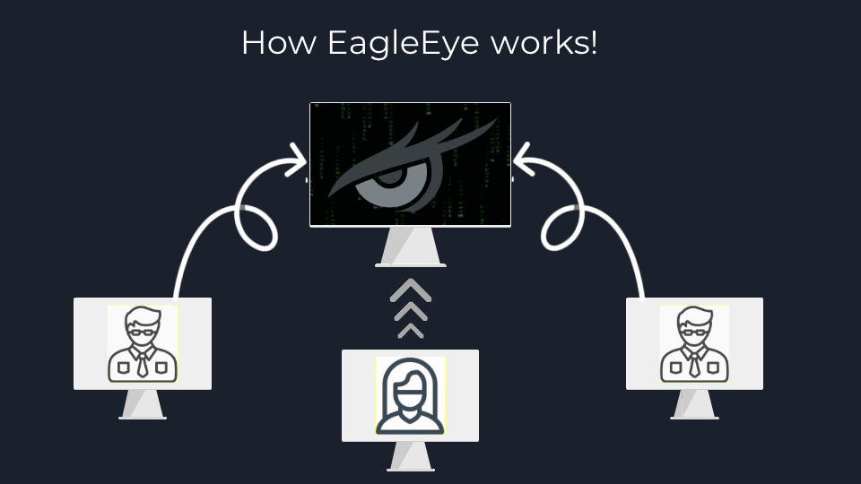
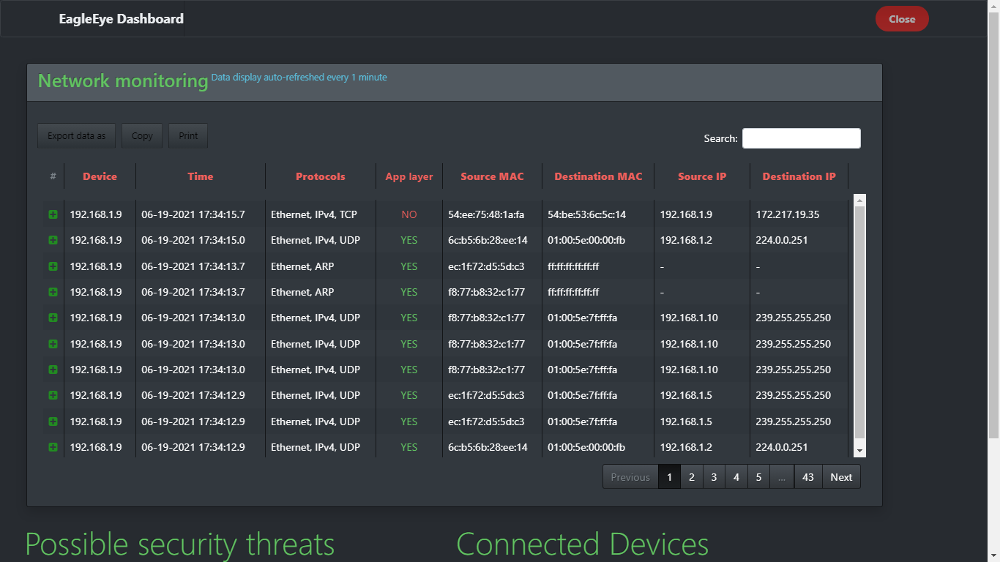
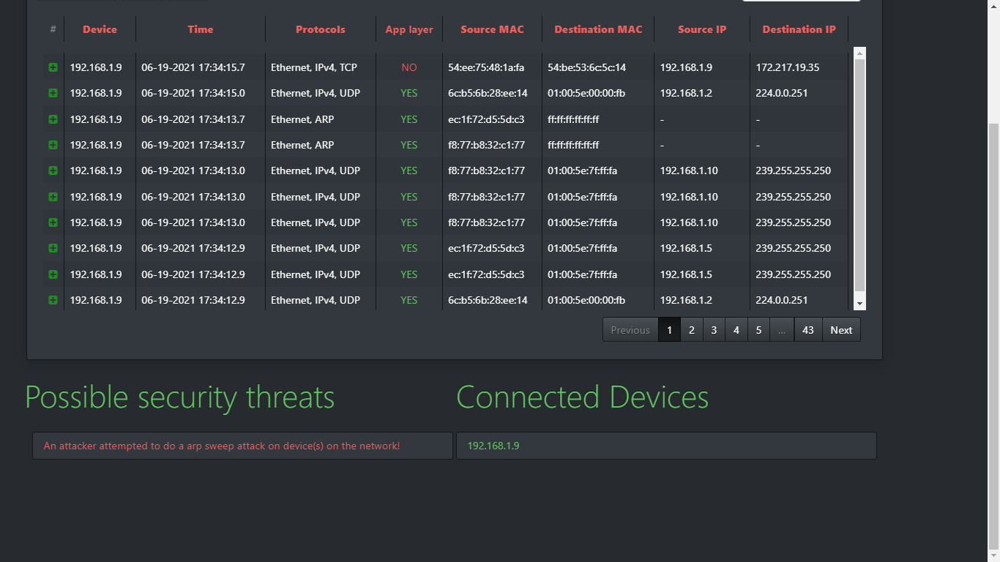

# EagleEye - an host-based IDS and network monitoring system
> This is project needs a lot of work to be ready to use as it's my graduation project so it's not user-friendly, only for experienced users, beta version, and I published/made it only for educational purpose!

- EagleEye consists of two parts:
  - **Client** *(Written in Golang)*
    + **Purpose:** Capture every packet on device and extract important details in famous protocols then finally send all the collected data to the master if online!
    + **Usage:** It should be installed on each device you want to monitor (ex: employee devices for companies).
  - **Master**: *(Written in Python and Bootstrap)*
    + **Purpose:** Receive every packet sent from the clients, display it organized in the GUI monitoring table, display connected devices information like current system user/system info, compare the captured data to the threats models already written before, and then finally alert the master user for possible security threats in the network as what a typical IDS system would do!
    + **Usage:** It should be running on a server on the same network as the clients (ex: a server managed by the IT department or blue hacking team for the company maybe).

> For more info, you will need to read about (I)ntrusion (D)etection (S)ystems and its types. I recommend [the NIST guide](https://nvlpubs.nist.gov/nistpubs/Legacy/SP/nistspecialpublication800-94.pdf).

## Screenshots

### Main GUI
</img></img>

---
### Monitoring table

> Notice the buttons in the table gives you the ability to export table as (CSV, Excel, PDF), copy table data to clipboard, and print the table data if you want.

### Monitoring table search
#### Simple search

#### Detailed search

> As you can see the search here gives you the ability to search for any thing represented in the table.
---
### Connected devices table
#### When a new client connected to the client

#### Information about each client

> Notice table refreshed automatically every 5s or on page refresh!
---
### Threats table
#### When a threats detected

#### Details about any possible threats detected + reference on click

#### Desktop notification for threats

> Notice table refreshed automatically every 5s or on page refresh!
---
## Installation instructions
### The Client
#### Requirements
- Supports Windows system only currently (Because of the data grabbed from the registry, need to change that).
- The following instructions

#### Installation instructions
1. Make sure you have Golang installed.
2. Install gopacket library by using this command:
`go get github.com/google/gopacket`
3. Download and install npcap from [here](https://nmap.org/npcap/).
4. Change the following variables in the code according to your needs:
  + *Line57:* Change variable **url** to your current Master url
  + *Line59:* Change variable **device** to the network interface you would listen to, for windows you will need [this article](https://haydz.github.io/2020/07/06/Go-Windows-NIC.html)!
  + *Line66:* Change variable **filter** to the filter you want in capturing network packets or leave it empty as it is (if you want to capture all packets). The filter syntax is bpf which is the same used in Wireshark search, you can learn it from [this guide](https://docs.extrahop.com/8.3/bpf-syntax/). I left some examples in the comments too, if anyone wants to use it.
5. In CMD navigate to the client directory, of course.
6. Now you can run the client as a script with this command: `go run main.go`
7. To compile/build it, you can use the following command: `go build -o client.exe main.go`, maybe you could need [this guide](https://golang.org/cmd/go/#Compile_packages_and_dependencies).
8. If you did all of these, go have a life dude :laughing: (Joking)
---
### The Master
#### Requirements
- Any OS.
- The following instructions, it's a lot easier than the client don't worry LOL!

#### Installation instructions
1. Make sure you have Python 3 installed (Version 3.5 and above) and pip.
2. In CMD navigate to the master folder then install the requirements by using this command: `pip install -r requirements.txt` or `python -m pip install -r requirements.txt`
3. If you are on windows and colored print in CMD matters to you, run this command: `pip install -r coloring-requirements.txt` or `python -m pip install -r coloring-requirements.txt`
4. Now a few variables to change according to your needs :laughing:
  + *Line21:* Change variable **host_port** to the port you want to serve on (Default:8000)
  + *Line23:* Change variable **serve_localhost** change to True if you want to run master on local host only (Default:True)
  + *Line24:* Change variable **view_browser** change to True if you want the master to open the serving url on the browser automatically (Default:True)
5. Now you can run the master by `python interface.py`
6. Have fun :)

# TODO list
- [ ] Expanding the GUI (user login, settings...)
- [ ] Add in-mail and SMS notifications.
- [ ] Optimize the network usage
- [ ] Add more threat models specially the more complicated ones like ARP-spoofing based attacks.
- [ ] Add detailed reports for security threats table.
- [ ] Add the ability to check the status of each client and change it if the device is not active and not online for, say, 1 hour.
- [ ] Make the client work on more platforms.
- [ ] Make a setup GUI for the client (More user friendly)
- [ ] TBD
